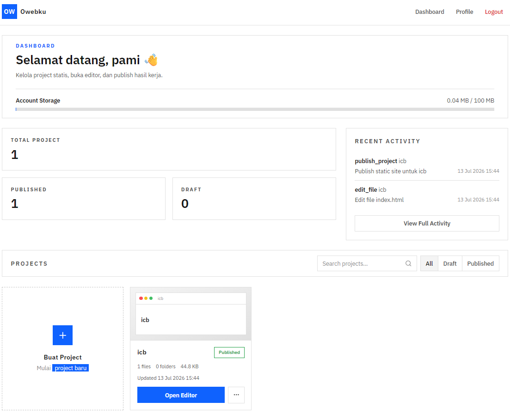
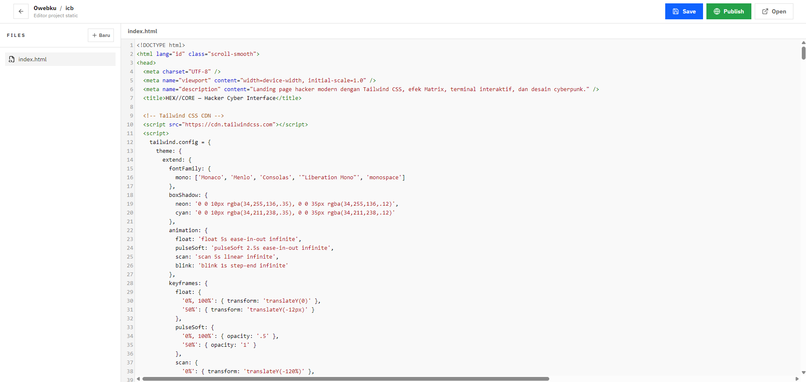
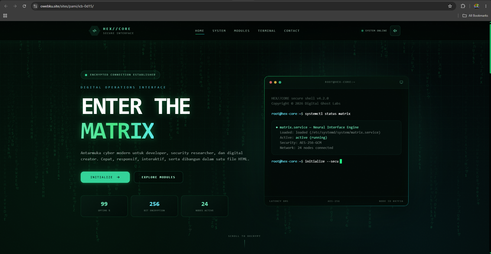

# Owebku

Owebku adalah aplikasi web berbasis **PHP Native MVC** untuk membuat, mengedit, mengelola, dan mem-publish project website pengguna. Project ini berisi dashboard, editor file berbasis browser, manajemen project, upload/import file, dan publish website ke folder publik.

---

## 1. Ringkasan

| Item | Keterangan |
|---|---|
| Nama project | Owebku |
| Jenis aplikasi | Fullstack web application / online code editor & web publisher |
| Backend | PHP Native OOP |
| Arsitektur | Custom MVC + service layer ringan |
| Database | MySQL / MariaDB via PDO |
| Frontend | PHP view, Tailwind CDN, CodeMirror CDN, vanilla JavaScript |
| Entry point | `index.php` |
| Routing | Manual route registry di `index.php` + dispatcher `src/core/Router.php` |
| Dependency manager | Tidak memakai Composer / NPM |
| Workspace draft | `storage/workspaces/{username}/{slug}/` |
| Output publish | `sites/{username}/{slug}/` |

---

## 2. Fitur Aplikasi

- Register, login, logout, dan update password.
- Dashboard daftar project dan aktivitas user.
- Create, rename, dan delete project.
- Editor project di browser dengan file tree dan preview.
- Read dan save isi file project.
- Create, rename, move, delete, upload file/folder.
- Import ZIP ke workspace dengan validasi keamanan.
- Publish workspace ke folder publik `sites/`.
- Activity log untuk aksi penting user.

---

## 3. Tampilan Aplikasi

Screenshot aplikasi disimpan di folder `screenshoot/`.

### 3.1 Dashboard



Dashboard menampilkan ringkasan project, status publish/draft, storage akun, aktivitas terbaru, pencarian project, dan aksi project.

### 3.2 Editor Project



Editor project menyediakan file manager, text editor berbasis browser, aksi file/folder, upload/import, dan preview project.

### 3.3 Contoh Website Hasil Publish



Website yang sudah dipublish disalin dari workspace draft ke folder publik `sites/{username}/{slug}/` dan dapat dibuka melalui public URL project.

---

## 4. Kebutuhan Sistem

| Komponen | Kebutuhan |
|---|---|
| PHP | PHP 8.0+; diuji pada PHP 8.1.10 |
| Database | MySQL / MariaDB |
| PHP extension | PDO MySQL, ZipArchive |
| Web server | PHP built-in server, Apache, atau Nginx |
| Browser | Browser modern |

Konfigurasi database berada di `src/config/database.php`.

| Key | Value default |
|---|---|
| Host | `localhost` |
| Port | `3306` |
| Database | `webdrop_db` |
| Username | `root` |
| Password | kosong |
| Charset | `utf8mb4` |

---

## 5. Menjalankan Project

### 5.1 Siapkan database

Buat database MySQL/MariaDB:

```text
webdrop_db
```

Lalu sesuaikan credential di:

```text
src/config/database.php
```

### 5.2 Pastikan folder runtime tersedia

```text
storage/
storage/logs/
storage/quarantine/
storage/workspaces/
sites/
public/uploads/
```

Folder tersebut digunakan untuk log, workspace user, karantina ZIP, output publish, dan upload publik.

### 5.3 Jalankan server lokal

Dari root project:

```text
php -S localhost:8000
```

Buka aplikasi:

```text
http://localhost:8000
```

---

## 6. Struktur Kode

```text
owebku/
├── index.php                  # Front controller, autoload, dan daftar route
├── README.md                  # Dokumentasi teknikal project
├── AGENTS.md                  # Panduan kerja AI agent di repo ini
├── screenshoot/               # Screenshot dokumentasi README
├── public/                    # Aset publik aplikasi
│   ├── assets/
│   │   ├── css/               # CSS aplikasi
│   │   ├── js/                # JavaScript dashboard/editor
│   │   └── media/             # Media publik
│   └── uploads/               # Upload publik jika dibutuhkan
├── sites/                     # Hasil publish website user
├── storage/                   # Data runtime/private aplikasi
│   ├── logs/                  # Log runtime
│   ├── quarantine/            # Ekstraksi ZIP sementara
│   ├── sites/                 # Storage tambahan untuk site jika dipakai
│   └── workspaces/            # Workspace draft user
└── src/
    ├── config/                # Konfigurasi aplikasi dan database
    ├── core/                  # Core MVC: Router, Controller, Model, Database
    │   └── services/          # SafePath, FileValidator, ZIP import, quota, move
    ├── helpers/               # Helper global
    ├── modules/               # Modul fitur aplikasi
    └── views/                 # Template PHP native
```

---

## 7. Arsitektur Kode

Project memakai pola **Front Controller + MVC**.

| Layer | Path | Tanggung jawab |
|---|---|---|
| Entry point | `index.php` | Start session, autoload class, load helper, register route, dispatch request |
| Router | `src/core/Router.php` | Cocokkan HTTP method + URL ke controller method |
| Controller | `src/modules/*/*Controller.php` | Orkestrasi request, auth, CSRF, validasi, panggil model/service, kirim response |
| Model | `src/core/Model.php`, `src/modules/*/*.php` | Query database dengan PDO prepared statement |
| Service | `src/core/services/` | Operasi file/path/ZIP/quota yang lebih kompleks dan berisiko |
| View | `src/views/` | Render HTML dengan PHP native |
| Helper | `src/helpers/utils.php` | Auth helper, CSRF, redirect, URL, escaping, flash message |

### 7.1 Alur request

1. Browser mengakses route aplikasi.
2. Request masuk ke `index.php`.
3. Autoloader dan helper dimuat.
4. Route didaftarkan di `index.php`.
5. `Router` mencari route yang sesuai.
6. Controller method dijalankan.
7. Controller menjalankan auth, CSRF, validasi input, dan ownership check bila perlu.
8. Controller memanggil model untuk database atau service untuk filesystem.
9. Response dikirim sebagai HTML view atau JSON.

---

## 8. Modul Utama

| Modul | Path | File utama | Fungsi |
|---|---|---|---|
| Auth | `src/modules/auth/` | `AuthController.php`, `User.php` | Register, login, logout, profile, update password |
| Dashboard | `src/modules/dashboard/` | `DashboardController.php` | Dashboard dan aktivitas user |
| Projects | `src/modules/projects/` | `ProjectsController.php`, `Project.php` | CRUD project, slug, workspace awal, metadata project |
| Files | `src/modules/files/` | `FilesController.php` | Editor, baca/simpan file, upload, import ZIP, rename, move, delete |
| Publish | `src/modules/publish/` | `PublishController.php` | Publish workspace ke `sites/` dan catat publish job |

---

## 9. Daftar Routing

Routing didefinisikan langsung di `index.php`. Router saat ini mendukung `GET` dan `POST`. Parameter dinamis memakai format `{nama}` seperti `/editor/{projectId}`.

### 9.1 Route halaman

| Method | Path | Controller | Fungsi |
|---|---|---|---|
| GET | `/` | `DashboardController::index` | Dashboard utama |
| GET | `/login` | `AuthController::index` | Form login |
| GET | `/register` | `AuthController::register` | Form register |
| GET | `/profile` | `AuthController::profile` | Halaman profil |
| GET | `/dashboard` | `DashboardController::index` | Dashboard project |
| GET | `/dashboard/activities` | `DashboardController::activities` | Riwayat aktivitas |
| GET | `/editor/{projectId}` | `FilesController::editor` | Editor project |
| GET | `/logout` | `AuthController::logout` | Logout |

### 9.2 Route aksi

| Method | Path | Controller | Fungsi |
|---|---|---|---|
| POST | `/login` | `AuthController::login` | Proses login |
| POST | `/register` | `AuthController::doRegister` | Proses register |
| POST | `/profile/update-password` | `AuthController::updatePassword` | Update password |
| POST | `/projects/create` | `ProjectsController::create` | Buat project |
| POST | `/projects/rename` | `ProjectsController::rename` | Rename project |
| POST | `/projects/delete` | `ProjectsController::delete` | Hapus project |
| POST | `/files/get-content` | `FilesController::getContent` | Ambil isi file |
| POST | `/files/save-content` | `FilesController::saveContent` | Simpan isi file |
| POST | `/files/create` | `FilesController::createFile` | Buat file/folder |
| POST | `/files/rename` | `FilesController::renameFile` | Rename file/folder |
| POST | `/files/move` | `FilesController::moveFile` | Pindah file/folder |
| POST | `/files/delete` | `FilesController::deleteFile` | Hapus file/folder |
| POST | `/files/upload` | `FilesController::uploadFile` | Upload file tunggal |
| POST | `/files/import-zip` | `FilesController::importZip` | Import ZIP |
| POST | `/publish` | `PublishController::publish` | Publish project |

---

## 10. Database

Database utama bernama `webdrop_db`. Aplikasi memakai PDO dengan prepared statement.

| Tabel | Fungsi |
|---|---|
| `users` | Data akun, email, username, password, role, status aktif |
| `projects` | Data project, owner, slug, workspace path, published path, public URL, status |
| `project_files` | Metadata file/folder di dalam workspace project |
| `activity_logs` | Riwayat aktivitas user dan project |
| `publish_jobs` | Riwayat proses publish |

Relasi utama:

```text
users 1..n projects
users 1..n activity_logs
users 1..n publish_jobs
projects 1..n project_files
projects 1..n activity_logs
projects 1..n publish_jobs
```

---

## 11. Storage dan File System

| Path | Fungsi |
|---|---|
| `storage/workspaces/{username}/{slug}/` | Workspace draft/private project user |
| `storage/quarantine/` | Lokasi ekstraksi sementara untuk validasi ZIP |
| `storage/logs/` | Log runtime aplikasi |
| `sites/{username}/{slug}/` | Output website setelah publish |
| `public/uploads/` | Upload publik aplikasi |

### 11.1 Alur project baru

1. User membuat project dari dashboard.
2. Sistem membuat slug project.
3. Record disimpan ke tabel `projects`.
4. Folder workspace dibuat di `storage/workspaces/{username}/{slug}/`.
5. File awal seperti `index.html` dibuat.
6. Metadata file dicatat ke `project_files`.

### 11.2 Alur edit file

1. User membuka `/editor/{projectId}`.
2. Sistem memvalidasi session dan owner project.
3. File tree dan metadata project dimuat.
4. User memilih file.
5. Isi file diambil melalui `/files/get-content`.
6. Perubahan disimpan melalui `/files/save-content`.
7. Metadata project dan activity log diperbarui.

### 11.3 Alur import ZIP

1. User upload ZIP melalui `/files/import-zip`.
2. ZIP diekstrak ke `storage/quarantine/`.
3. Entry ZIP divalidasi dari sisi path, ekstensi, ukuran, dan konten.
4. Jika valid, file dipindahkan ke workspace project.
5. Metadata file disimpan ke database.
6. Jika gagal, proses dibatalkan dan data sementara dibersihkan.

### 11.4 Alur publish

1. User menjalankan publish melalui `/publish`.
2. Sistem memvalidasi auth, CSRF, dan owner project.
3. Workspace draft dibaca dari `storage/workspaces/{username}/{slug}/`.
4. Folder publik `sites/{username}/{slug}/` disiapkan ulang.
5. Isi workspace disalin ke folder publik.
6. Status project berubah menjadi `published`.
7. Riwayat dicatat ke `publish_jobs` dan `activity_logs`.

> Publish bersifat mengganti isi folder output. Isi lama di `sites/{username}/{slug}/` dapat dihapus dan diganti dengan isi workspace terbaru.

---

## 12. Keamanan Aplikasi

- Auth memakai session PHP native.
- Password memakai `password_hash()` dan `password_verify()`.
- Route privat memakai helper `require_auth()`.
- Request `POST` memakai validasi CSRF melalui `verify_csrf()`.
- Akses project/file dicek berdasarkan owner user login.
- Query database memakai PDO prepared statement.
- Output user di view harus di-escape dengan `e()`.
- Operasi path/file memakai service seperti `SafePath`, `FileValidator`, `FileMoveService`, dan `ZipImportService`.
- ZIP import memakai quarantine sebelum file masuk ke workspace.
- Folder `sites/` berisi konten user; server tidak boleh mengeksekusi file berbahaya dari folder ini.

---

## 13. Konvensi Pengembangan

### 13.1 Route

- Tambahkan route baru di `index.php`.
- Gunakan method `GET` atau `POST` kecuali `Router` dikembangkan lagi.
- Route yang butuh login wajib memanggil `require_auth()`.
- Route `POST` yang mengubah state wajib memanggil `verify_csrf()`.

### 13.2 Controller

- Simpan controller di `src/modules/{nama-modul}/`.
- Controller mewarisi `Core\Controller`.
- Gunakan `$this->render()` untuk response HTML.
- Gunakan `$this->json()` untuk response JSON.
- Controller sebaiknya berisi orkestrasi, bukan query SQL panjang atau logic filesystem berat.

### 13.3 Model

- Model mewarisi `Core\Model`.
- Simpan query database di model.
- Gunakan prepared statement.
- Jangan memasukkan input user langsung ke string SQL.

### 13.4 Service

- Simpan logic file/path/ZIP/quota di `src/core/services/`.
- Gunakan `SafePath` untuk validasi path.
- Gunakan `FileValidator` untuk validasi upload.
- Gunakan `ZipImportService` untuk import ZIP.

### 13.5 View dan Frontend

- Simpan view di `src/views/`.
- Escape output user dengan `e()`.
- Form POST memakai `csrf_field()`.
- AJAX POST mengirim CSRF token melalui `FormData` atau header `X-CSRF-TOKEN`.
- CSS custom ada di `public/assets/css/`.
- JavaScript custom ada di `public/assets/js/`.

---

## 14. Alur End-to-End

1. User membuka aplikasi.
2. User register atau login.
3. Session login disimpan di server.
4. User masuk dashboard.
5. User membuat project baru.
6. Sistem membuat record database, folder workspace, dan file awal.
7. User membuka editor project.
8. User mengedit, membuat, menghapus, upload, atau import file.
9. Sistem menyimpan file ke `storage/workspaces/` dan metadata ke database.
10. User menjalankan publish.
11. Sistem menyalin workspace ke `sites/`.
12. Website user tersedia sebagai hasil publish.
13. Activity log dan publish job menyimpan riwayat proses.
